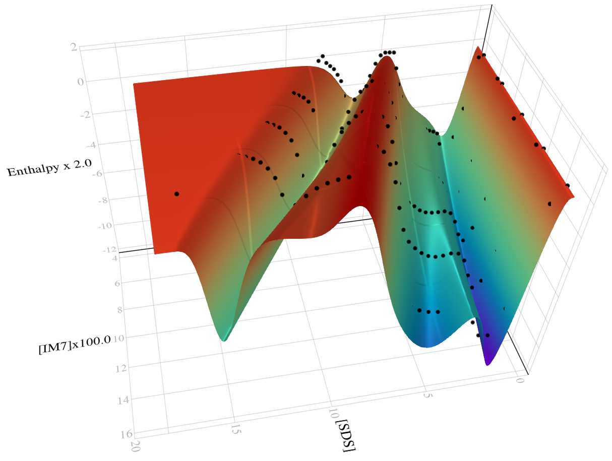

[CI](https://github.com/inverseproblem/ANISPROU.jl/workflows/CI/badge.svg)

# ANISPROU
Analysis of isothermal titration calorimetry (ITC) data on sodium dodecyl sulphate (SDS) mediated protein unfolding.

Documentation: https://inverseproblem.github.io/ANISPROU.jl/stable

If you use ANISPROU for a scientific publication or else, please cite our paper:
 
Tidemand F., Zunino A., Johansen N., Hansen A. F., Westh P., Mosegaard K., Arleth L. (2021), **A semi-empirical analysis of complex ITC data from protein-surfactant interactions**, *Analytical Chemistry*, DOI:10.1021/acs.analchem.1c02558
